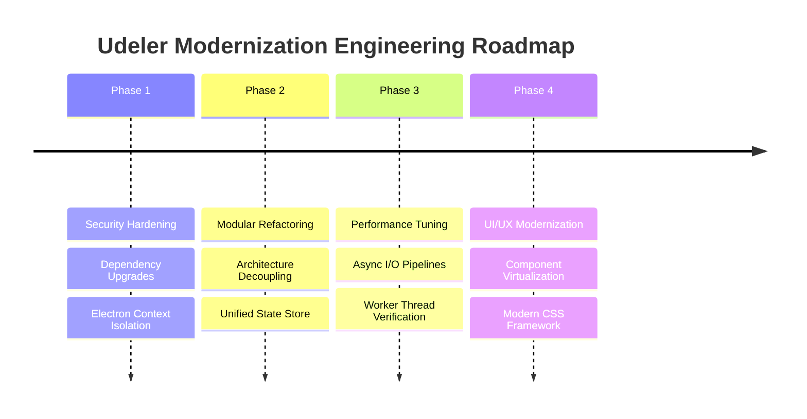

# Architectural & Engineering Code Review Report

**Repository:** [shuvojit19/Udemy-Downloader-GUI](https://github.com/shuvojit19/Udemy-Downloader-GUI)  
**App Version:** 1.14.0  
**Target Platform:** Electron Desktop (Windows, macOS, Linux)  
**Role:** Expert Software Architect & Principal Code Reviewer  

---

## Executive Summary

**Udeler (Udemy Course Downloader GUI)** is a cross-platform desktop application designed to download enrolled Udemy courses, lectures, attachments, subtitles, and playlists for offline viewing. 

While recent iterations have introduced crucial stability and usability enhancements—such as parallel M3U8 video segment downloading, strict sequence number locking, detailed audit logging, and course file verification—a deep-dive architectural analysis reveals significant technical debt, security vulnerabilities stemming from legacy Electron architecture, tight coupling between UI and business logic, and synchronous I/O bottlenecks.

This report presents a thorough structural evaluation of the codebase, identifies anti-patterns and performance constraints, and provides a concrete, multi-stage engineering roadmap for modernizing the project.

---

## 1. Architecture & Workflow Overview

### 1.1 System Architecture

The application is structured around a classic two-tier Electron process architecture:

```mermaid
graph TD
    subgraph Main Process ["Main Process (Node.js Environment)"]
        M1[main.js] --> M2[BrowserWindow Creation]
        M1 --> M3[Application Menu & Shell]
        M1 --> M4[IPC Handlers & App Lifecycle]
        M1 --> M5[Sentry Error Tracking]
    end

    subgraph Renderer Process ["Renderer Process (Chromium + Node Integration)"]
        R1[index.html / Semantic UI]
        R2[app.js - Monolithic Controller]
        R3[helpers/settings.js - Electron Settings API]
        R4[helpers/ui.js - Component DOM Templates]
        R5[core/services/udemy.service.js - Udemy REST API]
        R6[core/services/m3u8.service.js - HLS Playlist Parser]
        R7[mt-files-downloader - Multi-threaded Downloader Wrapper]
    end

    M2 -->|Loads| R1
    M4 <-->|IPC Bridge (saveDownloads, quitApp)| R2
```

### 1.2 Under the Hood Workflow

1. **Authentication & Session Acquisition**:
   - Users authenticate either via an Electron webview pop-up (`loginWithUdemy`) or by manually providing an access token (`loginWithAccessToken`).
   - Authentication headers (`Authorization: Bearer <token>`) are injected into Electron HTTP requests via `session.defaultSession.webRequest.onBeforeSendHeaders`.
   - Domain configurations (`www.udemy.com` vs. Udemy Business custom subdomains) are dynamically resolved and persisted in `Settings`.

2. **Course Discovery & Content Resolution**:
   - `UdemyService` (`app/core/services/udemy.service.js`) interacts with Udemy's REST API (`/users/me/subscribed-courses` and `/courses/{id}/subscriber-curriculum-items`).
   - Lectures, media sources (`stream_urls`, `media_sources`), attachments, and subtitles (`captions`) are fetched, parsed, and cached using `node-cache` (TTL 3600s).

3. **Queue & Download Engine**:
   - Courses are pushed to an active download queue managed in `app/app.js`.
   - Concurrent downloads are bounded by `maxConcurrentDownloads` (default: 4).
   - **Direct Video/MP4 Downloads**: Handled by `mt-files-downloader` using multi-threaded range requests (configured up to 8 parallel connections).
   - **HLS/M3U8 Stream Downloads**: Managed by `getPlaylist()` and `getFile()` in `app/app.js`, utilizing parallel chunk batching (`Promise.all` in batches of 10 concurrent HTTP requests) and appended to disk via Node `fs`.

4. **Verification & Audit Subsystem**:
   - Disk verification (`verifyCourseDownloads`) traverses expected directory structures, checking file existence and verifying non-zero file sizes (`fs.statSync(filePath).size > 0`).
   - Verification and DRM status badges (`[ Verified ]`, `[ Missing X files ]`, `[ DRM Protected ]`, `[ DRM Free ]`) are computed, stored in element data attributes, and rendered on separate lines inside `.course-status-tags`.
   - Results are automatically written to exported text logs via `appendLog` and `saveLogFile`.

---

## 2. Code Quality & Maintainability

### 2.1 Major Architectural Anti-Patterns

#### 🔴 Anti-Pattern 1: Monolithic Renderer Controller (`app/app.js`)
- **Issue**: `app/app.js` is over **3,100 lines long** and violates the **Single Responsibility Principle (SRP)**. It mixes DOM manipulation, event listeners, network calls, queue scheduling, sequence index assignment, file verification, M3U8 chunk concatenation, error dialogs, and logging into a single file.
- **Impact**: High risk of regression when making small changes; extreme difficulty in unit testing; low code reuse.

#### 🔴 Anti-Pattern 2: Deprecated Electron Security Configuration
- **Location**: `main.js` (lines 46–51)
```javascript
webPreferences: {
    nodeIntegration: true,
    enableRemoteModule: true,
    contextIsolation: false,
    preload: "./preload.js"
}
```
- **Issue**: Running Electron with `nodeIntegration: true` and `contextIsolation: false` exposes the renderer process directly to Node.js APIs. If malicious content or modified API payloads are loaded, arbitrary code execution (RCE) can occur on the host machine.
- **Impact**: Security vulnerability (CVE risk), non-compliant with modern Electron security guidelines.

#### 🔴 Anti-Pattern 3: The DOM as the Primary State Store
- **Issue**: Application state is stored directly inside HTML DOM elements using jQuery `.data()`, custom attributes (`course-completed`, `course-id`), and hidden input fields (`<input name="sequence-number">`).
- **Impact**: Any structural change to HTML templates breaks JS logic. State is volatile, scattered, difficult to debug, and prone to DOM race conditions during rapid re-renders.

#### 🔴 Anti-Pattern 4: Callback Chains & Deeply Nested Async Operations
- **Location**: `downloadLecture` -> `downloadChapter` -> `downloadAttachments` -> `endDownloadAttachment` in `app/app.js`.
- **Issue**: Asynchronous flow relies on mutual recursive callback invocation rather than `async/await` pipeline primitives or standard Task Queues.
- **Impact**: Re-entrancy bugs, potential stack memory build-up, and high complexity when tracking task failures.

### 2.2 SOLID Principles Compliance Matrix

| Principle | Status | Analysis |
| :--- | :---: | :--- |
| **S - Single Responsibility** | ❌ **Failed** | Modules handle UI, network, file I/O, state, and business logic concurrently. |
| **O - Open/Closed** | ⚠️ **Partial** | Extending file types or stream providers requires modifying core loops in `app.js`. |
| **L - Liskov Substitution** | ➖ **N/A** | Few class hierarchies are defined (mostly procedural functions & singleton services). |
| **I - Interface Segregation** | ❌ **Failed** | No formal interfaces or decoupling contracts between services and UI elements. |
| **D - Dependency Inversion** | ❌ **Failed** | Global singletons (`$`, `fs`, `ipcRenderer`, `Settings`) are directly coupled throughout code. |

---

## 3. Performance Bottlenecks

```mermaid
gantt
    title Bottleneck Analysis: Main JS Thread Execution Pipeline
    dateFormat  X
    axisFormat %s
    section Main UI Thread
    DOM Manipulation & Semantic UI Dropdowns   :active, a1, 0, 10
    Sync File System Calls (fs.statSync)       :crit, a2, 10, 35
    Buffer Allocation (Blob -> ArrayBuffer)   :crit, a3, 35, 55
    1-Second Timer Polling & DOM Updates      :active, a4, 55, 70
```



### 3.1 Synchronous File System Operations Blocking the Event Loop
- **Problem**: `app/app.js` heavily relies on synchronous Node `fs` methods: `fs.existsSync`, `fs.mkdirSync`, `fs.statSync`, `fs.appendFileSync`, and `fs.unlinkSync` during download loops and file verification (`verifyCourseDownloads`).
- **Impact**: When verifying a course with hundreds of files or writing large M3U8 video chunks to disk, synchronous disk I/O freezes the Chromium rendering thread, causing UI stuttering, unresponsive buttons, and frame drops.

### 3.2 In-Memory Buffer Accumulation During HLS Downloads
- **Problem**: `getPlaylist` converts fetched `Blob` stream responses into `ArrayBuffer` instances in RAM before calling `fs.appendFileSync`.
- **Impact**: High garbage collection (GC) pressure and unnecessary memory allocation spikes when downloading 1080p video streams with hundreds of chunks.

### 3.3 Frequent Un-virtualized DOM Re-rendering
- **Problem**: Every course card is rendered directly into `.ui.courses.items` as a complex DOM subtree containing multiple action buttons, indicators, progress bars, and tag containers.
- **Impact**: When users have 50+ enrolled courses in their library or queue, DOM node counts scale into thousands, slowing down search filtering, sorting, and tab navigation.

### 3.4 Un-throttled Speed Polling
- **Problem**: A 1-second interval timer (`timerDownloader`) continuously queries `dl.getStats()` and mutates jQuery DOM nodes (`$downloadSpeedValue.html(...)`).
- **Impact**: Frequent layout recalibration and paint operations on the main thread, even when download values haven't meaningfully changed.

---

## 4. UI/UX & Responsive Design Improvements

```carousel

<!-- slide -->
### UI Layout & Alignment Architecture
- **Left-Aligned Status Tag Rows**: Base tags (`Seq #X`, `Download Finished`), Verification Status (`Verified 100% Intact` / `Missing X files`), and DRM Status (`DRM Free` / `DRM Protected`) are cleanly stacked on separate left-aligned flex rows.
- **Dedicated Red Sync Download Button**: Added to action button row for instant missing file re-downloads.
```

### 4.1 Structural UI Enhancements
1. **Modern Component Framework Transition**:
   - Replace Semantic UI (which is unmaintained and relies heavily on legacy jQuery plugins) with a lightweight modern library like **TailwindCSS + React** or **Svelte**.
   - Decouple card rendering into pure functional components driven by a centralized state store (e.g. Redux Toolkit or Zustand).

2. **Virtualized List Rendering**:
   - Implement windowed list rendering (`react-window` or `@tanstack/react-virtual`).
   - Render only visible course cards in the viewport, reducing DOM nodes from thousands to ~10 active nodes regardless of queue size.

3. **Dedicated Log Viewer Component**:
   - Convert the current basic `#logger` textarea into a searchable, filterable log table with level filtering (INFO, WARN, ERROR), copy-to-clipboard, and real-time auto-scroll controls.

4. **Improved Visual Status Hierarchy**:
   - Maintain the multi-line tag alignment architecture (Line 1: Sequence & Completion, Line 2: Verification Status, Line 3: DRM Status).
   - Add tooltips and progress percentages directly into card status headers.

---

## 5. Prioritized Actionable Roadmap



### 🟢 Phase 1: Security & Infrastructure Modernization (Immediate)
- [ ] **Enforce Electron Security Sandbox**:
  - Update `main.js` `webPreferences` to set `contextIsolation: true`, `nodeIntegration: false`, and `enableRemoteModule: false`.
  - Expose safe, explicit IPC methods via `preload.js` using `contextBridge.exposeInMainWorld()`.
- [ ] **Upgrade Core Runtime**:
  - Upgrade Electron from outdated `v11.5.0` to the latest LTS version (Electron 30+).
  - Update `axios`, `jquery`, and security-patched npm dependencies.

### 🟡 Phase 2: Architectural Decoupling & Refactoring (High Priority)
- [ ] **Extract Single-Responsibility Services**:
  - Split `app/app.js` into distinct, single-purpose modules:
    - `QueueManager.js`: Handles task queuing, concurrency limits, and execution order.
    - `VerificationEngine.js`: Dedicated disk scanning, file integrity verification, and missing file calculation.
    - `DRMInspector.js`: Detects stream encryption and media license requirements.
    - `LogManager.js`: Centralized logger service.
- [ ] **Eliminate DOM-As-State Anti-Pattern**:
  - Create a centralized JavaScript state store (`StateStore`) holding course objects and queue data in memory.
  - Make DOM rendering purely reactive based on state store changes.

### 🟠 Phase 3: Performance & Disk I/O Optimization (Medium Priority)
- [ ] **Asynchronous Disk I/O Pipeline**:
  - Replace all synchronous `fs.*Sync` operations with `fs.promises` (`fs.promises.stat`, `fs.promises.mkdir`, `fs.promises.writeFile`).
  - Stream HLS video segments directly to `fs.createWriteStream` instead of allocating intermediate `Blob` array buffers in RAM.
- [ ] **Offload Verification to Worker Threads**:
  - Move heavy course file integrity verification (`verifyCourseDownloads`) off the main JS thread into a Node `worker_threads` instance.

### 🔵 Phase 4: UI/UX & Frontend Refactoring (Future Enhancement)
- [ ] **Migrate UI Framework**:
  - Replace Semantic UI with modern utility-first CSS (TailwindCSS) or custom CSS variables.
- [ ] **Implement Virtualized List View**:
  - Integrate virtualized scrolling for course card lists to optimize memory and maintain 60 FPS rendering.
- [ ] **Enhanced Filter & Batch Action Toolbar**:
  - Add quick action toolbar buttons: "Verify All Courses", "Check DRM For All Courses", "Download All Missing Files", and "Clear Completed".

---

## Conclusion

The recent updates to Udeler have significantly improved downloading speed (via parallel M3U8 chunk batching), queue stability (via permanent sequence locking), and file integrity (via missing file auto-detection and dedicated repair options). 

Implementing the 4-phase architectural roadmap will resolve underlying technical debt, harden app security to modern Electron standards, and ensure high responsiveness and maintainability for long-term project success.
